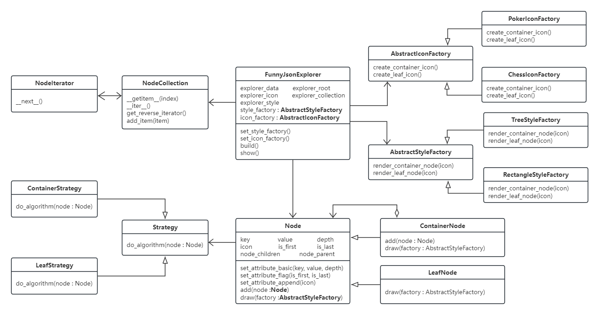
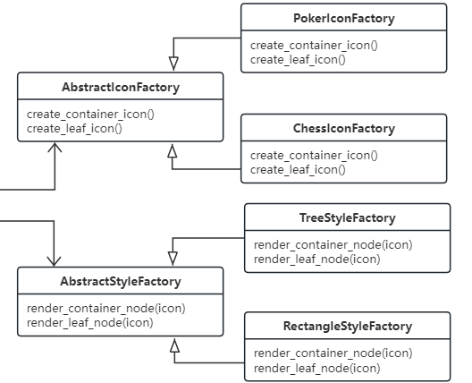
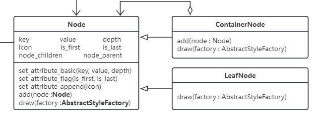
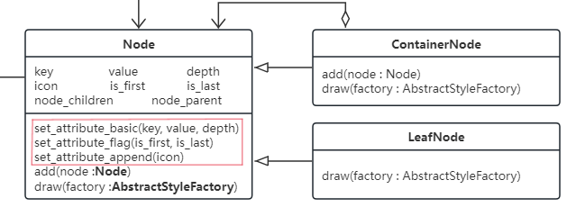
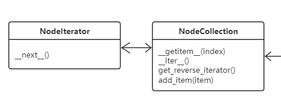
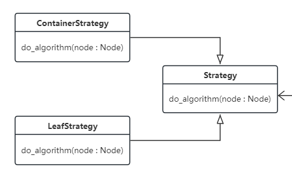

# Funny JSON Explorer

## 使用方法

在 conda 环境下，进入代码文件并在命令行执行：

`python main.py -f <file> -s <style> -i <icon>`

`<file>` 为JSON文件的路径。

`<style>` 为渲染风格，目前支持 `tree` 和 `rectangle`。

`<icon>` 为渲染图标族，目前支持 `poker` 和 `chess`。

## 输出展示

 

 

## UML类图

## 设计模式

### 抽象工厂

### 组合模式

### 建造者模式

### 迭代器模式

### 策略模式

